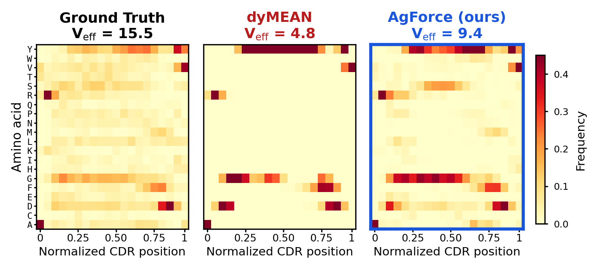
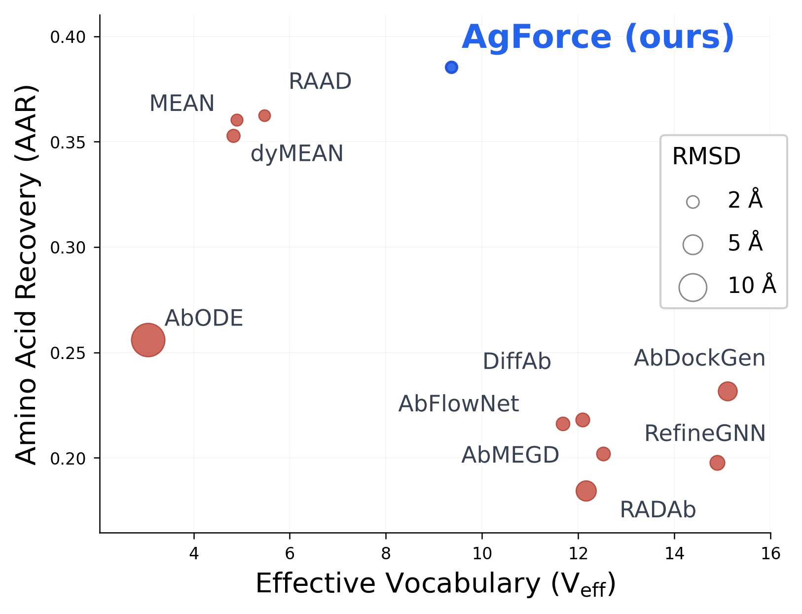
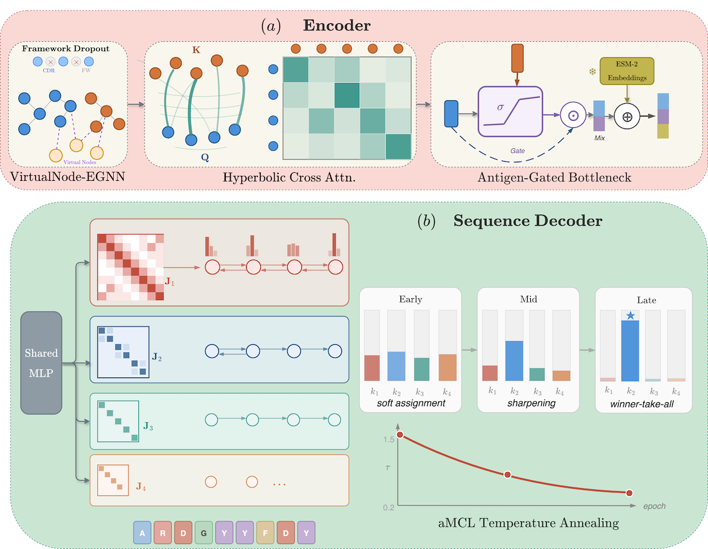

# AgForce Enables Antigen-conditioned Generative Antibody Design

## まず何の論文か

AgForceは、抗原構造を条件として抗体CDR、主にCDR-H3の配列とバックボーン構造を同時に設計する生成モデルの論文である。著者らの問題意識は、既存の「抗原条件付き」抗体設計モデルが、実際には抗原入力を十分に使っていないのではないか、という点にある。論文はまずCHIMERA-Bench上で11種類の既存手法を再評価し、GNN系モデルが高いAARを出す一方で、同じようなCDR配列を多くの抗原に対して出してしまうことを示す。著者はこの現象を、抗原盲目性、語彙崩壊、per-position cross-entropy ceilingという3つの失敗モードとして整理する。特に、位置ごとのクロスエントロピーを最適化すると、条件付き情報ではなく位置ごとのアミノ酸周辺分布に収束しやすい、という理論的な説明を与えている点が重要である。提案モデルAgForceは、VirtualNode-EGNN、framework dropout、hyperbolic cross-attention、MDN-Potts sequence head、annealed Multiple Choice Learning、抗原分類損失を組み合わせ、抗体フレームワークへのショートカットを弱めながら抗原情報がデコーダに入るように設計されている。評価ではCHIMERA-Benchのepitope-group splitを用い、AgForceはCDR-H3でAAR 0.40、RMSD 1.60 Å、fnat 0.67、DockQ 0.74、epitope F1 0.77を達成し、配列回復・構造品質・界面品質を同時に改善したと報告されている。特に、RefineGNNのような抗原非依存モデルが強いbinding metricを示す事実を逆手に取り、既存の条件付けが本当に抗原特異的かを問う診断論文としての価値が高い。実装はGitHubで公開されているが、現時点でLICENSEファイルとAgForceの学習済み重み公開リンクは確認できなかった。抗体設計研究では「ベンチマーク上で高いAAR」だけでは抗原特異的設計の証拠にならない、という警告として読むべき論文である。

## 書誌情報

- URL/DOI: https://arxiv.org/abs/2605.21610 / DOI: 10.48550/arXiv.2605.21610
- 公開日/更新日: arXiv v1 2026-05-27
- 著者・所属: Mansoor Ahmed（Georgia State University / Georgia Institute of Technology）, Murray Patterson（Georgia State University）
- 掲載誌/プレプリントサーバー: arXiv preprint
- リサーチ日: 2026-07-06
- 分類: 新着 / モデル起点 / ベンチマーク利用

## 背景と問題設定

この研究が扱う問題は、抗原構造、エピトープ指定、抗体フレームワークが与えられたときに、標的抗原に結合するCDR配列と構造を生成することである。抗体医薬開発では、CDR、特にCDR-H3が抗原認識の中心を担うため、標的エピトープに合わせたCDR設計は重要な創薬課題になる。

近年はDiffAb、MEAN、dyMEAN、RAAD、AbFlowNet、AbMEGDなど、抗原構造を入力する深層生成モデルが多数提案されている。しかし著者らは、これらのモデルの多くが「抗原を入力している」ことと「抗原に条件付けられた設計をしている」ことを混同していると見る。既存研究でも、unigram frequencyだけで予測の多くを説明できる、BLOSUMスコアが学習モデルの出力をかなり説明する、抗原鎖を除いても出力がほぼ変わらない、といった懸念が報告されていた。

この論文の問題設定は、単に新しい生成モデルを作ることではなく、なぜ既存の抗原条件付きモデルが抗原を無視するのかを診断し、その失敗モードに対応する設計を入れることである。抗体研究にとって重要なのは、AARやRMSDの改善だけではなく、異なる抗原・エピトープに対して本当に異なるCDR分布を生成しているかである。もしモデルが抗体フレームワークや位置ごとのアミノ酸頻度から平均的なCDRを復元しているだけなら、in silico affinity maturationやエピトープ特異的de novo設計には使いにくい。

## この論文のコアアイデア

中心的な主張は、標準的なGNN + per-position cross-entropy + greedy decodingという設計が、抗原条件付きCDR設計には不十分だということである。著者らは、位置ごとのクロスエントロピーの最適解が、条件付き入力ではなく位置ごとのアミノ酸周辺分布に近づきうると整理する。この場合、モデルは抗原ごとの違いを使わなくても、頻出残基を各位置に置くだけで損失を下げられる。結果として、GlyやTyrのような頻出・界面でよく使われる残基に予測が偏り、希少だが重要なTrp、Cys、Metなどがほとんど出なくなる。

AgForceはこの問題に対して、エンコーダとデコーダの両方に介入する。エンコーダ側では、抗体フレームワーク情報に頼りすぎるショートカットを弱めるため、heavy-chain framework embeddingにdropoutをかける。また、CDRとエピトープ間の情報伝達をVirtualNode-EGNNとhyperbolic cross-attentionで強める。デコーダ側では、単一のsoftmax分類器ではなく、K=4のMixture Density NetworkとPotts風の隣接残基カップリングを使い、複数の候補分布を持てるようにする。さらにannealed Multiple Choice Learningで各componentが異なる訓練例に専門化するよう促し、GDPP正則化で分布多様性を保つ。最後に、予測CDR分布から抗原embeddingを識別させるInfoNCE型の抗原分類損失を入れ、抗原情報がsequence decoderを通って勾配として効くようにしている。

## 手法の詳細

- 入力データ: 抗原構造、エピトープ残基集合、抗体heavy/light chain framework、CDR位置。各残基はアミノ酸種とバックボーン4原子座標を持つ。CDRアミノ酸は訓練時にマスクされる。
- 出力: 設計対象CDR、主評価ではCDR-H3、のアミノ酸配列とCαバックボーン座標。
- モデル/アルゴリズム: 5層VirtualNode-EGNN、4-head hyperbolic cross-attention、MDN-Potts sequence head、structure coordinate head、antigen classification head。
- 特徴量・表現学習: 108次元の残基特徴量を使う。位置埋め込み、結合距離RBF、二面角・結合角、局所座標フレーム方向、アミノ酸identity、interface complementarity、segment embeddingを含む。ESM-2 650Mの凍結embeddingもsequence headに連結する。
- 学習方法: AdamWで最大50 epoch、early stopping patience 10。aMCL temperatureは2.0から0.1へ20 epochでanneal。単一H100でfull trainingは約2時間と記載。
- 損失関数・目的関数: sequence loss（MDN-Potts + aMCL）、coordinate smooth L1 loss、shadow paratope loss、GDPP diversity regularization、InfoNCE型antigen classification lossを合成する。損失重みは座標1.301、shadow 0.664、GDPP 0.05、antigen classification 0.2。
- 推論方法: CDRアミノ酸をマスクした複合体グラフを入力し、各位置でmixture weightが最大のcomponentを選び、そのcomponent内のargmaxアミノ酸を出す。座標はEGNNのcoordinate streamから出す。
- ベースライン: RAAD、MEAN、dyMEAN、DiffAb、AbFlowNet、AbMEGD、RADAb、dyAb、AbODE、RefineGNN、AbDockGen。
- 評価指標: AAR、CAAR、PPL、Cα RMSD、fnat、iRMSD、DockQ、epitope F1、unique sequence fraction、entropy ratio、effective vocabulary、interface enrichment correlation。
- 実装上の重要点: CDR-to-epitope情報伝達をvirtual nodesとhyperbolic attentionで明示化し、抗原分類損失の勾配を予測配列分布に通す点が重要である。READMEの実行例には `chimera_trainer.py` が出るが、クローンしたリポジトリでは `trainer.py` と `chimera_evaluate.py` は確認でき、READMEとファイル名にずれがある可能性がある。

## データセットと評価設計

使用データセットはCHIMERA-Benchで、2,922件の抗体-抗原複合体からなる。主評価はepitope-group splitで、train/validation/testは2,338/292/292件である。論文はこのsplitを最も難しい設定として扱っている。エピトープグループで分割するため、単純なランダム分割よりも、同一または類似エピトープのリークを抑える意図がある。

対象は抗体-抗原複合体で、主にCDR-H3設計を評価する。sequence qualityはAAR、接触位置に限定したCAAR、perplexityで測る。structure qualityはCα RMSDで、binding/interface qualityはfnat、iRMSD、DockQ、epitope F1で測る。界面指標はCDR残基に限定し、Cα-Cα距離8 Åの対称contactで定義される。

評価設計の妥当性は比較的高い。AARだけでなくDockQやepitope F1、さらにunique sequence fractionやeffective vocabularyまで見るため、「平均的なCDRを出してAARだけ稼ぐ」モデルを検出しやすい。ただし、全評価は計算機上の既存構造への再構成・復元タスクであり、新規設計配列を実験で発現・結合検証したものではない。したがって、薬剤候補生成能力そのものを証明する評価ではなく、既知複合体分布上での条件付き設計能力の評価と読むべきである。

## 主要結果

主結果では、AgForceがCDR-H3設計でAAR 0.40、CAAR 0.21、PPL 2.95、RMSD 1.60 Å、fnat 0.67、iRMSD 1.30 Å、DockQ 0.74、epitope F1 0.77を示す。GNN系のRAAD、MEAN、dyMEANはいずれもAAR 0.37付近に並び、著者らのいうcross-entropy ceilingに沿った挙動を示す。AgForceのAAR改善は0.37から0.40で、絶対値では3ポイントだが、論文中では強いsequence baselineに対して約8%改善と説明される。

binding metricでは、抗原入力を持たないRefineGNNがfnat 0.65、iRMSD 1.42 Å、DockQ 0.73、epitope F1 0.76と非常に強い。これは既存モデルの抗原条件付けが必ずしも本質的でないことを示す重要な観察である。AgForceはRefineGNNをfnat 0.67、iRMSD 1.30 Å、DockQ 0.74、epitope F1 0.77でわずかに上回る。改善幅は大きくないが、sequence recoveryとinterface qualityを同時に上げた点が主張の核である。

一方、CAARは0.21で、MEANの0.24やdyMEANの0.22を明確に上回っていない。著者らも、接触位置で正確なアミノ酸を当てる問題は依然として難しく、改善は主にnon-contactおよびanchor positionsから来ていると述べる。これは、AgForceが抗原特異的分布を改善しても、原子レベルの側鎖相互作用や多対一の結合モードを解くには不十分であることを示している。

抗原条件付け解析では、AgForceのunique predicted sequencesは95.5%で、RAAD 76.4%、MEAN 66.8%、dyMEAN 20.9%を上回る。entropy ratioもGNN baselineの0.40-0.48から0.70へ上がる。effective vocabularyはAgForceが9.4で、GNN baselineの3.0-5.5から大きく改善するが、nativeの約15.5やsampling-based methodの11.7-14.9にはまだ届かない。interface amino acid enrichment patternとground truthの相関はAgForceがr=0.78で最良とされ、抗原界面で使うべき残基タイプを分布レベルでは学べていることを示す。

アブレーションでは、hyperbolic attentionを除くとfnatが0.671から0.634、DockQが0.740から0.723に下がる。antigen classification lossを除くとAARは0.395から0.393とほぼ維持されるが、fnatは0.639、DockQは0.726へ下がる。framework dropoutを除くとfnatは0.630へ下がり、抗体フレームワークショートカットを抑える設計が界面品質に効いていることを示す。ESM-2を除くとAARが0.393から0.368へ落ち、凍結PLM embeddingが配列回復に大きく寄与している。

## 重要なFigure/Table

- Figure/Table番号: Figure 1
- 何を示しているか: CDR-H3における語彙崩壊の可視化と、AARとeffective vocabularyの関係。
- 読み取り方: ground truth、dyMEAN、AgForceの位置別アミノ酸分布を比較し、特定残基に予測が集中していないかを見る。右側のAAR対effective vocabularyでは、精度と多様性を同時に見られる。
- 主要な数値・傾向: native CDR-H3のeffective vocabularyは約15.5、GNN greedy decodingは3.0-5.5に崩壊し、AgForceは9.4まで回復する。AARはAgForceが0.40で、GNN baselineの0.37付近を上回る。
- なぜ重要か: この論文の診断概念であるvocabulary collapseを一枚で理解できる。AARだけではなく、多様性を同時に見る必要があることを示す。
- Markdown内での扱い: 埋め込み
- 出典URL: https://arxiv.org/abs/2605.21610
- ライセンス確認: 確認済み（arXivページにCC BY 4.0表示）

出典: Ahmed and Patterson, Figure 1(a), arXiv:2605.21610, CC BY 4.0, https://arxiv.org/abs/2605.21610

出典: Ahmed and Patterson, Figure 1(b), arXiv:2605.21610, CC BY 4.0, https://arxiv.org/abs/2605.21610

- Figure/Table番号: Figure 3（論文中のarchitecture figure）
- 何を示しているか: AgForceのエンコーダ・デコーダ構成。framework dropout、VirtualNode-EGNN、hyperbolic cross-attention、ESM-2連結、MDN-Potts head、antigen classification lossの接続を示す。
- 読み取り方: 抗原情報がエピトープembeddingからhyperbolic attentionを通じてCDR representationに入り、最終的にsequence distributionと抗原分類損失へ流れる点を見る。
- 主要な数値・傾向: 5-layer VN-EGNN、3 virtual nodes、4 attention heads、K=4 MDN components、2-round belief propagation、ESM-2 650M frozen embeddingが使われる。
- なぜ重要か: 失敗モードごとの介入がどこに入っているかを把握できる。単なるGNN改良ではなく、decoder objectiveとconditioning pathの設計が主役であることが分かる。
- Markdown内での扱い: 埋め込み
- 出典URL: https://arxiv.org/abs/2605.21610
- ライセンス確認: 確認済み（arXivページにCC BY 4.0表示）

出典: Ahmed and Patterson, architecture figure, arXiv:2605.21610, CC BY 4.0, https://arxiv.org/abs/2605.21610

- Figure/Table番号: Table 1
- 何を示しているか: CHIMERA-Bench epitope-group splitの292 test complexesにおけるCDR-H3設計性能。
- 読み取り方: AAR/PPL/RMSDだけでなく、fnat、iRMSD、DockQ、epitope F1を横断して、配列・構造・界面品質のトレードオフを見る。
- 主要な数値・傾向:

| Method | AAR | CAAR | RMSD | fnat | iRMSD | DockQ | epiF1 |
| --- | ---: | ---: | ---: | ---: | ---: | ---: | ---: |
| RAAD | 0.37 | 0.21 | 1.75 | 0.56 | 1.48 | 0.70 | 0.72 |
| MEAN | 0.37 | 0.24 | 1.84 | 0.57 | 1.53 | 0.69 | 0.72 |
| RefineGNN | 0.21 | 0.10 | 2.86 | 0.65 | 1.42 | 0.73 | 0.76 |
| AgForce | 0.40 | 0.21 | 1.60 | 0.67 | 1.30 | 0.74 | 0.77 |

- なぜ重要か: AgForceの主張である「sequence recoveryとbinding qualityの同時改善」を支える中心表である。同時に、RefineGNNが抗原なしで強いbinding metricを出すという問題提起も読める。
- Markdown内での扱い: 要約表
- 出典URL: https://arxiv.org/abs/2605.21610
- ライセンス確認: 確認済み（arXivページにCC BY 4.0表示。ただし表は必要列のみ再構成）

## Code / License / Weights

- コード公開: あり
- GitHub URL: https://github.com/mansoor181/ag-force
- GitHub以外のコードURL: なし
- 実装種別: 公式 / 著者実装
- GitHub確認: 確認済み
- リポジトリのライセンス: ライセンス未記載
- ライセンス確認元: GitHubクローン内にLICENSEファイルなし、READMEにもライセンス記載なし
- Hugging Face URL: 見つからず
- Hugging Face種別: 該当なし
- モデル重み・チェックポイント公開: 見つからず
- 重み公開URL: 見つからず
- データセット公開: あり（CHIMERA-Benchを使用）
- データセットURL: https://huggingface.co/datasets/mansoorbaloch/chimera-bench / https://zenodo.org/records/20598827 / https://github.com/mansoor181/chimera-bench
- 再現性メモ: GitHubにはtraining/evaluationコード、設定、前処理スクリプトがある。READMEのusageは短く、`chimera_trainer.py` というファイル名が示されているが、確認したクローンでは同名ファイルは見当たらず、`trainer.py` と `chimera_evaluate.py` が中心に見える。論文は「code and model weights will be released upon acceptance」とも記載しているが、2026-07-06確認時点でAgForce本体の学習済み重みは見つからなかった。`evaluation/ddg/data/model.pt` はddG評価用の補助モデルと見られ、AgForce checkpointではない可能性が高い。

## 抗体研究・創薬への意味

この論文の価値は、抗体設計モデルの評価に「抗原特異性が本当にあるか」という観点を強く持ち込んだ点にある。抗体医薬開発では、単に天然CDRらしい配列を出すだけでは不十分で、標的抗原・エピトープに応じてパラトープ残基の分布が変わる必要がある。AgForceは、抗体フレームワークから平均的なCDRを補完するだけのモデルと、抗原情報を使って分布を変えるモデルを区別する診断軸を提示している。

創薬応用では、エピトープ特異的抗体設計、CDR-H3 grafting、親和性成熟候補の多様化、既存抗体フレームワーク上のCDR置換探索に接続しやすい。特にeffective vocabularyやunique sequence fractionは、生成候補の多様性を監視する実務的な指標として使える。AgForceのMDN-Potts headは、単一argmaxではなく複数の局所的に整合したアミノ酸分布を持たせる考え方であり、将来的にはin vitro display library設計やactive learningでの候補多様化にも応用できる。

ただし、AgForceは実験的結合検証を含まないため、創薬候補を直接出せることを示した論文ではない。むしろ、抗体AIモデルを読むときに「AARが高い」「抗原を入力している」だけでは足りず、抗原を取り替えたときの出力変化、contact AAR、界面残基分布、DockQ、epitope F1、生成多様性を見るべきだと教えてくれる論文である。

## 限界と注意点

著者が述べている限界:

- CAARはベースラインと同程度で、接触位置の正確なアミノ酸予測は依然として難しい。
- effective vocabularyはGNN baselineより大きく改善するが、native diversityには届かない。
- 接触残基の予測には、side-chain rotamerや物理エネルギー項の明示的なモデリングが必要かもしれない。
- 論文本文にはコメントアウトされた形で、joint multi-CDR generation、end-to-end PLM fine-tuning、実験検証が今後の自然な拡張と示唆されている。

読んで気づいた限界:

- 評価はCHIMERA-Bench上の再構成タスクであり、de novoに設計した配列の発現、安定性、凝集性、免疫原性、結合親和性を実験で検証していない。
- CDR-H3中心の評価で、H鎖・L鎖6 CDRの同時設計や抗体全体の developability までは扱っていない。
- AgForceの改善幅はAARやDockQでは堅実だが劇的ではなく、特にCAARで明確な勝利はない。
- CHIMERA-Bench由来の構造分布に依存するため、低解像度構造、予測抗原構造、柔軟な抗原、糖鎖や膜タンパク質などへの一般化は未確認である。
- GitHubリポジトリにLICENSEがなく、商用利用や再配布の判断がしにくい。
- 学習済みAgForce checkpointが見つからないため、論文値の即時再現には自前学習が必要になる可能性が高い。
- READMEと実ファイル名にずれがある可能性があり、再現実験では環境構築とコマンド確認に追加作業が必要である。

## この論文を読む上での前提知識

- CDRとCDR-H3: 抗体の可変領域にある相補性決定領域で、抗原認識の主要部分を担う。CDR-H3は特に多様性が高く、抗原特異性に強く関わる。
- AARとCAAR: Amino Acid Recoveryは天然配列のアミノ酸をどれだけ復元できたかを示す。CAARは抗原接触位置に限定したAARで、より直接的に界面設計の難しさを反映する。
- DockQ、fnat、iRMSD: タンパク質複合体ドッキング品質の指標。fnatは天然接触の再現率、iRMSDは界面の座標ずれ、DockQは複合体品質の総合指標である。
- E(3)-equivariant GNN: 3次元回転・並進に対して座標出力が一貫して変換されるGNN。タンパク質構造のような3D幾何データに適している。
- Cross-entropy ceiling: この論文の用語で、位置ごとのクロスエントロピー最適化が、条件付き情報ではなく位置ごとの周辺分布を学ぶ方向に収束しうるという問題を指す。
- Mixture Density Network: 1つの出力分布ではなく複数componentの混合分布を予測するモデル。多峰性を表現できるため、1つの抗原に対して複数の妥当なCDR候補がある状況に合う。
- Potts model: アミノ酸間のペア相互作用を表す統計モデル。ここでは隣接CDR位置のアミノ酸組み合わせを整合させるためのpairwise couplingとして使われる。
- InfoNCE / contrastive loss: 正例ペアと負例ペアを区別する損失。AgForceでは、予測CDR分布から対応する抗原embeddingを識別させることで、抗原情報をsequence decoderに反映させる。

## 今日この1報を選んだ理由

前回採用したCHIMERA-Benchの直後に読む価値が高い論文だからである。CHIMERA-Benchはエピトープ特異的抗体設計の評価基盤を提供したが、AgForceはそのベンチマークを使って既存モデルの失敗モードを診断し、さらに新しいモデルを提案している。したがって、前回ノートとのObsidian上の接続が強く、ベンチマークからモデル改善へ知識を積み上げやすい。

また、単なる新規モデル論文ではなく、抗体生成モデル評価の見方を変える論文である点を重視した。AAR、RMSD、DockQだけでなく、unique sequence fraction、entropy ratio、effective vocabulary、interface enrichment correlationを見る必要性を示している。コードも公開されており、CHIMERA-Benchの公開データと合わせて再現性確認の入口がある。一方でLICENSEや学習済み重みの未整備もあり、実際に使う際の注意点を記録する価値がある。

## 読む優先度

High。AI×抗体設計を追ううえで、抗原条件付きモデルの「条件付けが本当に効いているか」を評価する観点は非常に重要である。前回のCHIMERA-Benchとセットで読むと、データセット、評価指標、モデル改善の流れを理解しやすい。AgForce自体の性能改善はまだ限定的な面もあるが、失敗モードの診断と評価指標の整理は後続研究を読む基準になる。

## 自分用メモ

- 後で深掘りしたい点: cross-entropy ceilingの証明がどこまで一般的に成り立つか。条件付き入力が十分に情報を持つ場合でも、有限モデル・有限データ・greedy decodingでどの程度同じ問題が起きるか。
- 関連して読むべき論文: CHIMERA-Bench、RAAD、MEAN、dyMEAN、DiffAb、RefineGNN、FlowDesign、PottsMPNN、TERMinator。
- 実装を触る場合の入口: GitHubの `trainer.py`、`model/core.py`、`model/pairwise_decoder.py`、`model/hyperbolic.py`、`chimera_evaluate.py` を確認する。READMEのコマンドとファイル名が一致するか要確認。
- Obsidianでリンクしたいキーワード: [[CHIMERA-Bench]], [[CDR-H3]], [[抗原条件付き抗体設計]], [[AAR]], [[DockQ]], [[effective vocabulary]], [[MDN]], [[Potts model]], [[E(3)-equivariant GNN]], [[ESM-2]]

## 関連キーワード

- antibody design
- antigen-conditioned generation
- CDR-H3 design
- epitope-specific antibody design
- CHIMERA-Bench
- vocabulary collapse
- antigen blindness
- cross-entropy ceiling
- VirtualNode-EGNN
- hyperbolic attention
- MDN-Potts
- annealed Multiple Choice Learning
- InfoNCE
- DockQ

## 検索ログ

- 検索したデータベース/クエリ:
  - Web検索: `site:arxiv.org antibody design machine learning arxiv 2026 antibody generative model`
  - Web検索: `site:biorxiv.org antibody design deep learning 2026 AI antibody`
  - Web検索: `AI antibody design benchmark 2026 arXiv`
  - Web検索: `antibody antigen binding prediction deep learning 2026 arXiv`
  - Web検索: `AgForce Table 1 AAR`, `AgForce CDR-H3 DockQ`, `AgForce Chimera-Bench Ablation`
  - GitHub確認: `git ls-remote https://github.com/mansoor181/ag-force.git HEAD`、リポジトリclone
  - Hugging Face検索: `site:huggingface.co AgForce antibody`, `site:huggingface.co "AgForce Enables Antigen-conditioned Generative Antibody Design"`, `"mansoor181" "ag-force" weights checkpoint`
- 候補にした論文:
  - AgForce Enables Antigen-conditioned Generative Antibody Design
  - 前回候補として記録されていたAgForce、IgCraft、AbMEGD、RFAntibody、DiffAb、MEAN、RefineGNN、AbBiBench
- 最終的にこの1報を採用した理由: 前回採用したCHIMERA-Benchと直接つながり、抗原条件付き抗体設計モデルの評価・失敗モード・改善策を一度に学べるため。新着性があり、コードも公開されている。
- 新着論文と基盤論文のバランスをどう考えたか: 前回も2026年の新着ベンチマークを採用しているが、今回はそのベンチマークを使う新着モデル論文を選び、知識を縦に接続することを優先した。次回以降はAbLang、ESM-2、DiffAb、MEANなど基盤論文を挟む価値がある。
- PDF/HTML/Supplementaryを確認できたか: arXiv abs、arXiv source、LaTeX本文、Figure画像を確認。Supplementaryはmain.tex内のappendixとして確認。
- Figure/Tableを確認したURLやライセンス確認状況: arXivページ https://arxiv.org/abs/2605.21610 でCC BY 4.0を確認。arXiv source内のFigure画像とTable 1、Table 2を確認。
- GitHub/コード検索で使ったクエリ: 論文abstract記載のGitHub URL、`git ls-remote`、clone後のREADME/LICENSE/weight/checkpoint検索。
- 確認したGitHub URL: https://github.com/mansoor181/ag-force
- 確認したHugging Face URL: AgForce本体は見つからず。CHIMERA-Bench datasetとして https://huggingface.co/datasets/mansoorbaloch/chimera-bench を確認済み。
- 確認したその他コード/重み/データURL: CHIMERA-Bench GitHub https://github.com/mansoor181/chimera-bench、Zenodo https://zenodo.org/records/20598827、arXiv source https://arxiv.org/e-print/2605.21610
- リポジトリライセンスの確認元: GitHub clone内のLICENSEファイル検索、README確認。LICENSEなし、READMEにライセンス記載なし。
- モデル重み・チェックポイントの確認先: GitHub clone内で `*weight*`, `*checkpoint*`, `*.pt`, `*.pth`, `*.ckpt` を検索。`evaluation/ddg/data/model.pt` は見つかったが、AgForce本体のcheckpointとは判断できず、学習済みAgForce重みは見つからず。
