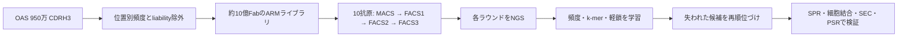

# High-throughput machine learning-aided antibody discovery for cell surface antigens

> [HTMLビジュアルノート](20260910_High-throughput%20machine%20learning-aided%20antibody%20discovery%20for%20cell%20surface%20antigens.html)

## まず何の論文か

この論文は、抗体探索の最後に機械学習を付け足すのではなく、最初から「機械学習で扱いやすいデータが残る」ように合成Fabライブラリと選別実験を設計した研究である。多様性を主に重鎖CDR3（CDRH3）へ集中し、CDRH3配列と軽鎖の組み合わせを100塩基未満の antigen recognition module（ARM）として読み取れるようにした。CDRH3の位置別アミノ酸頻度はOAS由来のナイーブB細胞9.5百万配列に合わせ、システイン、メチオニン、凝集・多反応性につながる既知モチーフを避けた。VH1-69重鎖と4種類の軽鎖から約10億種類のFabを構成し、PD-L1、PD-L2、TIGIT、ROBO1/2など10種の細胞表面関連抗原を並列にスクリーニングした。最終選別から424抗体を発現でき、302抗体がSEC、354抗体が多特異性試験を通過し、285抗体は両方を通過した。さらに103抗体がSPRで `KD < 10 nM`、118抗体が細胞表面結合で `EC50 < 25 nM` を示した。一方、選別後半でクローン多様性が急減しても、残った頻度上位クローンが必ずしも最良の結合体ではなかった。そこでMACSからFACS1への濃縮を1〜3-mer特徴量で学習するロジスティック回帰を作り、ROBO2Nの初期候補1,909 ARMから後半で失われた29配列を選んだ。実験すると上位10抗体中9抗体が強い結合速度論を示し、11抗体がROBO2発現細胞へ結合した。PD-L2でも従来選別の偽陽性率86%を48%へ下げ、33候補中17抗体に細胞結合を確認した。68,000超の標的関連ARM配列、486抗体の特性データ、MITライセンスの解析コードが公開されており、抗体探索を「選別結果」ではなく再学習可能なデータ生成系として捉え直した点が重要である。

## 書誌情報

- URL/DOI: [10.1016/j.cels.2026.101645](https://doi.org/10.1016/j.cels.2026.101645) / [Cell Systems本文](https://www.sciencedirect.com/science/article/pii/S2405471226001274) / [PubMed 42335897](https://pubmed.ncbi.nlm.nih.gov/42335897/)
- 公開日/更新日: オンライン公開 2026-06-23、Volume 17 Issue 8 掲載 2026-08-19
- 著者・所属: Deepash Kothiwal, Aaron W. Kollasch, Murali Anuganti, Nicholas Hollmer, Anita Ghoshほか29名。主な所属はInstitute for Protein Innovation、Harvard Medical School、Boston Children's Hospital、Scripps Research、Broad Institute、Sorbonne Universitéなど。
- 掲載誌/プレプリントサーバー: Cell Systems 17(8), 101645（プレプリント: bioRxiv, DOI [10.1101/2025.05.15.650607](https://doi.org/10.1101/2025.05.15.650607)）
- リサーチ日: 2026-09-10（JST）
- 分類: 新着 / ベンチマーク・データセット / その他（実験・ML統合基盤）

## 背景と問題設定

抗体のyeast/phage displayでは、巨大な配列空間から抗原結合クローンを物理的に濃縮できる。しかし、FACSで後半まで残る頻度は親和性だけでなく、酵母上での表示量、重鎖・軽鎖の組み合わせ、増殖速度、PCR/シーケンス誤差にも左右される。そのため「最後に多いクローン＝最良の抗体」とは限らず、初期ラウンドに存在した有用配列を捨ててしまう。

同時に、抗体MLに必要な抗体配列・標的・非結合例・選別軌跡・実測特性を同一条件でそろえたデータは少ない。通常の抗体ライブラリでは6本のCDR、重軽鎖ペア、選別条件が複雑に変化するため、配列と表現型の対応を学びにくい。本研究はこの二つの問題を、(1) 多様性をCDRH3中心へ絞った読みやすいARM、(2) 各ラウンドのNGS、(3) SPR・細胞結合・SEC・多反応性までつないだ実測ラベル、という設計で解こうとした。

抗体研究上の価値は、より複雑な生成モデルを提案したことではない。ウェット選別そのものをML用データ生成装置へ変え、単純で解釈可能なモデルでも従来選別の取りこぼしを回収できると示した点にある。

## この論文のコアアイデア

ARMは、可変なCDRH3配列と、どの軽鎖と対になっているかを示す同義置換バーコードを、短いアンプリコンにまとめた「パラトープの短縮コード」である。重鎖骨格をVH1-69へ固定し、軽鎖をVK1-39、VK3-15、VK3-20（比較的flatな結合面）とVK4-1（長いCDRL1を持つconcaveな結合面）に限定することで、選別結果をCDRH3の配列パターンとして解析しやすくした。

実験側では、1回のMACS後に3回のFACSを行い、抗原濃度を100 nM、20 nM、4 nMへ下げながら選別した。各段階のARMをNGSで追跡する。計算側では、MACSからFACS1で増えたARMを陽性、増えなかったARMを陰性とし、CDRH3の1-mer、2-mer、3-merカウントと鎖identityを特徴量にした正則化ロジスティック回帰を学習する。最終ラウンド頻度ではなく、初期濃縮に共通する短い配列パターンを使って、後半で消えた候補を再順位づけする。

*原論文Figure 1、2、5を参考にした独自の要約フロー（原図の転載ではない）。*

## 手法の詳細

- 入力データ: CDRH3長11〜17残基を中心とするARM配列、軽鎖バーコード、MACS/FACS1/FACS2/FACS3のread count。MLではFACS1で5 read以上の配列を使用。
- 出力: FACS1通過確率、および実験検証へ回す抗体候補。
- モデル/アルゴリズム: scikit-learn 1.1.3の `LogisticRegression`。MethodsにはL1 penalty、強度1.0と記載。本文では非正則化/L2も比較したとされ、最終実装との表記差はコード確認時に注意が必要。
- 特徴量・表現学習: CDRH3の1/2/3-mer countをL2正規化し、重鎖・軽鎖identityをone-hot化。大規模事前学習や3D構造入力は使わない。
- 学習方法: ROBO2NまたはROBO1について、FACS1 countがMACS countより増加した配列を1、同じか減少した配列を0とする二値分類。
- 損失関数・目的関数: ロジスティック回帰の正則化付き二値対数尤度（論文に式の明示なし）。
- 推論方法: FACS1候補を確率スコア化し、`P(selection) > 0.8`、FACS1 `>200 CPM`、既製作抗体からLevenshtein距離5以上、候補同士も距離5以上で絞る。
- ベースライン: 後半FACSでのクローン頻度に基づく通常選別、非正則化/L2設定の比較、ROBO1/ROBO2N間の交差スコアリング。
- 評価指標: train/test/validationのAUROC、SPRの `ka`, `kd`, `KD`、細胞displayの `EC50`、SEC、PSR、多標的交差反応性、エピトープ競合。
- 実装上の重要点: ARMが100 nt未満なので高深度NGSと安価な再合成が容易。軽鎖ペアを同義置換バーコードで保持する。選別後のMLだけでなく、各ラウンドを保存・配列決定することが要点。

## データセットと評価設計

### ライブラリと標的

- OAS由来のナイーブB細胞CDRH3 9.5百万配列から位置別頻度を設計。
- 2サブライブラリの深度シーケンスで3.90億unique CDRH3を観測し、各サブライブラリの実効多様性は約 `2.5×10^8`。4軽鎖を合わせたFab多様性は約10億と推定。
- 標的はPD-L1、PD-L2、TIGIT、LOX1、DKK1、IL23R、DCC、ROBO1、ROBO2N、Syncytin-2の10種。大きさ、fold、近縁性を意図的に変えている。
- 一般的な「train/validation/test分割」は、ライブラリ全体には該当しない。ROBO2N MLでは1,909 ARMの80%を訓練、20%をhold-out testとし、FACS3残存ARMを別validationに使用した。

### リーク対策と妥当性

候補選択時に、既に作製したROBO1/ROBO2N抗体および選択候補同士からLevenshtein距離5以上を要求したため、近縁クローンの単純再発見はある程度避けている。またROBO2NモデルをROBO1実測抗体へ適用し、94%同一なN末端を共有するparalog間で交差エピトープを識別できるかを確認した。

ただし、ランダムsplitは同じ選別キャンペーン由来であり、配列クラスタ単位や標的単位の厳密な外挿評価ではない。FACS3 validationも独立実験ではなく同じ選別軌跡の後半である。真のzero-shot抗体設計を主張できる設計ではなく、「同一キャンペーン内の早期データを再利用する候補救済」の評価として読むべきである。

## 主要結果

| 段階・評価 | 結果 | 読み方 |
|---|---:|---|
| 注文した重鎖 / 発現成功 | 429 / 424 | 発現工程の成功率は約98.8% |
| SEC合格 | 302 / 424 | 凝集・分解が厳しい基準内 |
| PSR合格 | 354 / 424 | avidin/DNA/insulin/Sf9 membraneへの多反応性なし |
| SECとPSRの両方合格 | 285 / 424 | 約67.2%が両developability基準を通過 |
| SPR | 103抗体が `KD < 10 nM` | 可溶性抗原に対する高親和性群 |
| 細胞display | 118抗体が `EC50 < 25 nM` | 完全ectodomainを細胞上で認識 |
| ROBO2N ML救済 | 29候補中11が細胞結合 | 上位10中9は強いSPR kinetics |
| PD-L2 ML救済 | 33候補中17が細胞結合 | 偽陽性率86%→48%。ただしSPRは弱め |

ライブラリ品質では、ランダム配列やナイーブB細胞由来配列の約60%が少なくとも1つの不利なモチーフを含むのに対し、設計ライブラリではそれらをほぼ除去できた。OASとのk-mer頻度Spearman相関は1-mer 0.93、2-mer 0.78、3-mer 0.76で、自然レパートリーの統計を保ちつつliabilityを減らした。最終FACSではCDRH3 cluster数がFACS1の約1,000から約100へ減少したが、頻度上位が最良のpotencyとは限らなかった。

ROBO2Nでは、後半選別で単一クローンが優占した一方、初期1,909 ARMには多様性が残っていた。MLで拾い直した11抗体はすべてROBO1にも結合したが、PD-L1、PD-L2、DCC、LOX1には交差しなかった。これはROBO1/2 N末端の94%配列同一性に整合する。エピトープビニングではROBO1 32抗体、ROBO2N 18抗体をSPRで調べ、ROBO1では4 bin、ROBO2Nでは12抗体からなる支配的binと6つの周辺抗体を確認した。特にML由来ROBO2N抗体のうち2つは互いに競合せず、頻度救済だけでなくエピトープ多様性の回復にもつながった。

## 重要なFigure/Table

### Figure 2

- Figure/Table番号: Figure 2
- 何を示しているか: 10抗原の構造的多様性、MACS→3回FACS→NGSの選別、424抗体の発現、SEC/PSR、細胞EC50、SPR kineticsを一続きに示す。
- 読み取り方: 「ライブラリの大きさ」だけでなく、抗原選別後に全長IgGへ戻し、developabilityとnative-like cell-surface bindingまで確認した点を見る。
- 主要な数値・傾向: 424発現、285がSEC+PSR合格、103が `KD <10 nM`、118が `EC50 <25 nM`。
- なぜ重要か: ML用データセットのラベルがNGS enrichmentだけではなく、直交する実測評価へつながっていることを示す。
- Markdown内での扱い: 独自の再構成表
- HTML内での扱い: 独自のフロー図・比較チャート
- 出典URL: [Cell Systems本文](https://www.sciencedirect.com/science/article/pii/S2405471226001274)
- ライセンス確認: 確認済み（CC BY-NC-ND 4.0。原図は転載しない）

### Figure 5

- Figure/Table番号: Figure 5
- 何を示しているか: 初期MACS/FACS1のk-mer特徴からROBO2N候補をスコア化し、後半で失われた29配列を救済する流れ、ROC、既存抗体からの配列距離、11抗体の細胞EC50。
- 読み取り方: AUROCだけでなく、「物理選別で消えた」「既知抗体から5残基以上離れた」「再合成後に結合した」の3段階を追う。
- 主要な数値・傾向: 1,909 ARM→29再合成候補→11細胞結合、上位10中9が強いSPR kinetics。
- なぜ重要か: 本論文のAI部分が、ブラックボックス生成ではなく選別データの取りこぼし救済であることを最も明確に示す。
- Markdown内での扱い: 独自の要約フロー
- HTML内での扱い: 独自のファネル図
- 出典URL: [Cell Systems Figure 5を含む本文](https://www.sciencedirect.com/science/article/pii/S2405471226001274)
- ライセンス確認: 確認済み（CC BY-NC-ND 4.0。原図は転載しない）

### Figure 6

- Figure/Table番号: Figure 6
- 何を示しているか: ROBO1/ROBO2N抗体の競合ネットワークと、ROBO2NモデルによるROBO1交差結合抗体の識別。
- 読み取り方: 線で結ばれた抗体は同じエピトープ空間で競合する。支配的binの外側、特に非競合なML救済抗体に注目する。
- 主要な数値・傾向: ROBO1は4 bin、ROBO2Nは12抗体の中心binと6周辺抗体。2つのML由来抗体が相互非競合。
- なぜ重要か: MLが単に同じホットスポットの類似クローンを増やしたのではなく、選別で失われたエピトープ多様性を一部回収したことを示す。
- Markdown内での扱い: 詳細な読み解きとリンクのみ
- HTML内での扱い: 原図とは異なる独自のネットワーク模式図
- 出典URL: [Cell Systems Figure 6を含む本文](https://www.sciencedirect.com/science/article/pii/S2405471226001274)
- ライセンス確認: 確認済み（CC BY-NC-ND 4.0。原図は転載しない）

## Code / License / Weights

- コード公開: あり
- GitHub URL: [debbiemarkslab/ML-antibody-discovery](https://github.com/debbiemarkslab/ML-antibody-discovery)
- GitHub以外のコードURL: [Zenodo 10.5281/zenodo.20060875](https://doi.org/10.5281/zenodo.20060875)
- 実装種別: 著者実装 / 公式
- GitHub確認: 確認済み
- リポジトリのライセンス: MIT
- ライセンス確認元: GitHubのLICENSEファイル、repository metadata、Zenodo metadata
- Hugging Face URL: 該当なし
- Hugging Face種別: 該当なし
- モデル重み・チェックポイント公開: 該当なし（ロジスティック回帰をデータから学習するコードで、汎用の学習済み基盤モデルではない）
- 重み公開URL: 該当なし
- データセット公開: あり
- データセットURL: [Zenodo 10.5281/zenodo.15707494](https://doi.org/10.5281/zenodo.15707494)
- 再現性メモ: ZenodoデータはCC BY 4.0で、抗原別のselection CSV、library key、486抗体のbiophysics CSVを含む。コードarchiveはMIT。READMEにはデータ取得手順がある。公開データからモデル学習とスコア計算は追えるが、約10億Fabの実ライブラリ構築、MACS/FACS、SPR、細胞displayの完全再現には大規模なウェット設備と抗原・プラスミド資源が必要。

## 抗体研究・創薬への意味

第一に、抗体探索を一回限りのwinner selectionから、全ラウンドを学習資産として残すclosed-loopへ変えられる。早期ラウンドで消えた配列を再スコアするだけでも候補数とエピトープ多様性が増えるため、難標的やparalog選択性の設計に有効である。

第二に、68,000超のARMには陽性だけでなく濃縮軌跡と非結合候補が含まれる。これは抗体-抗原結合予測、選別バイアス補正、active learning、epitope binning予測の実験接地データになる。SPR、細胞表面EC50、SEC、PSRを同じ抗体へ付けた486抗体表は、親和性とdevelopabilityを同時に考える小規模なmulti-objective datasetとして価値がある。

第三に、単純なk-merロジスティック回帰が有効だったことは、モデル複雑性よりデータ生成設計がボトルネックになりうることを示す。次の一手は、抗体言語モデルや構造表現を加えること自体ではなく、標的・scaffold・選別バッチを越えた分割で本当に一般化するかを検証することである。

## 限界と注意点

### 著者が述べる限界

- VH1-69と4軽鎖に強く制約され、CDR1/CDR2を固定しているため、それらの多様性が必要なパラトープへ到達できない。
- 公開NGSにはPCR/sequence error、低頻度クローンの抗原間cross-contaminationがあり、追加のcleaningが必要。
- さらに多くのheavy/light-chain pair、抗原family、抗体用途へ拡張する必要がある。
- PD-L2のML救済抗体は細胞結合を示したが、SPR特性はやや弱かった。

### 読み手としての追加注意

- MLラベルはFACS1/MACSの相対countであり、直接的な `KD` や機能ラベルではない。display・増殖・測定バイアスも含む代理目的である。
- random 80/20 splitは近縁配列をまたぐ可能性があり、cluster splitより楽観的になりうる。FACS3 validationも完全独立ではない。
- MLの主検証はROBO2NとPD-L2の2標的で、10標的に同じ改善が出るとは限らない。
- ROBO1/2はN末端が94%同一なのでparalog transferには好条件である。低相同性標的間やzero-shotへの外挿は未検証。
- `EC50` は細胞表面での見かけの結合、SPR `KD` は可溶性constructとの結合であり、治療機能、安全性、免疫原性、in vivo PKを直接保証しない。
- 論文本体はCC BY-NC-ND 4.0、データはCC BY 4.0、コードはMITで条件が異なる。原図の改変・再配布や商用利用では論文ライセンスに注意する。

## この論文を読む上での前提知識

- **CDRとCDRH3**: 抗体可変領域の6本の相補性決定領域のうち、CDRH3は特に多様で抗原接触の中心になりやすい。本研究はこの領域へ主な多様性を集約する。
- **Fab yeast display**: 酵母表面にFabを提示し、蛍光標識抗原との結合を細胞単位で選ぶ方法。配列頻度は結合だけでなく表示量や増殖にも影響される。
- **MACS/FACS**: MACSは磁気ビーズで大きく濃縮し、FACSは蛍光強度で細かく選別する。後半ほど選択圧を強めると親和性は上がりやすいが、多様性を失う。
- **k-mer**: 配列中の連続したk残基。本研究は1〜3残基の頻度で局所モチーフを表し、ロジスティック回帰へ入力する。
- **SPR kinetics**: `ka` は会合、`kd` は解離、`KD=kd/ka` は平衡解離定数。一般に `KD` が小さいほど高親和性。
- **SECとPSR**: SECは凝集・分解を、PSRは無関係分子への多反応性をみる。結合が強くてもこれらが悪い抗体はdevelopabilityが低い。
- **Levenshtein距離**: 挿入・削除・置換を含む編集距離。異なるCDRH3長をまたいで既知配列から離れた候補を選ぶために使う。

## 今回この1報を選んだ理由

2026-09-07の前回はin silico抗体探索のprospective benchmarkを扱ったため、今回はそれを補完する「MLが学べる選別データをどう作るか」に焦点を移した。正式版が2026-08-19にCell Systemsへ掲載された新着であり、単一抗体・単一標的の最適化ではなく10抗原、68,000超の配列、486抗体特性を公開している。生成モデルの派手さはないが、ウェット選別の取りこぼしを実験で救済し、コード・データ・ライセンスがそろうため、実装と批判的評価の学習価値が高い。候補だったDual-Specific Antibody Designは臨床応用のインパクトが大きい一方、プラットフォームと訓練データが非公開で再現性評価が難しいため、今回は本論文を優先した。

## 読む優先度

**High**。抗体MLで最も不足している「標的付き・陰性付き・選別軌跡付き・直交実測付きデータ」をどう設計するかが具体的で、公開物をすぐ検証できる。モデル論文を読む際のsplit、proxy label、実験検証を監査する基準としても有用である。

## 自分用メモ

- 後で深掘りしたい点: Zenodoの抗原別CSVをcleaningし、CDRH3 cluster splitとantigen holdoutでロジスティック回帰/PLMを再比較する。
- 関連して読むべき論文: Erasmus et al. 2023（NGS-guided selection）、AIntibody challenge 2024/2026、AntiFold 2025、Xu & Davis 2000（CDRH3 diversity sufficiency）。
- 実装を触る場合の入口: GitHubの `antibody_sorting_regression.py` とREADMEのZenodo取得手順。
- Obsidianでリンクしたいキーワード: [[yeast display]], [[CDRH3]], [[antigen recognition module]], [[active learning]], [[antibody developability]], [[epitope binning]], [[negative data]]

## 関連キーワード

- synthetic Fab library
- VH1-69
- OAS
- ARM
- MACS / FACS / NGS
- logistic regression
- ROBO1 / ROBO2 / PD-L2
- affinity / developability / polyspecificity
- ML-ready antibody dataset

## 検索ログ

- 検索したデータベース/クエリ: PubMed、bioRxiv、arXiv、Cell Systems/ScienceDirect、GitHub、Zenodo、Hugging Face。`antibody machine learning 2026`, `antibody design AI September 2026`, `High-throughput machine learning-aided antibody discovery dataset GitHub`, `ROBO2N logistic regression antibody` など。
- 候補にした論文: *Dual-Specific Antibody Design Using Artificial Intelligence*、*IgGM2: An All-Atom Foundation Model for Adaptive Immune Receptor Design*、*De novo design of ligand binding proteins using large language models alone*、本論文。
- 最終的にこの1報を採用した理由: 直接的な抗体探索、正式誌掲載の新着性、実験検証、公開コード/データ、前回benchmark論文との補完性。
- 新着論文と基盤論文のバランス: 今回は新着。CDRH3 minimalist libraryという基盤概念も同時に学べる。
- PDF/HTML/Supplementaryを確認できたか: Cell Systems最終HTML、bioRxiv公開PDF、最終版のMethods/Figure caption、GitHub/Zenodo metadataを確認。出版社サイトは自動閲覧時にCAPTCHAとなったため回避せず、公開検索インデックスと合法的なbioRxiv PDFを併用した。
- Figure/Tableを確認したURLやライセンス確認状況: [Cell Systems](https://www.sciencedirect.com/science/article/pii/S2405471226001274)でFigure 2/5/6とCC BY-NC-ND 4.0を確認。原図は保存・転載せず独自要約図にした。bioRxiv版はCC BY-NC 4.0。
- GitHub/コード検索で使ったクエリ: 論文タイトル、`ML-antibody-discovery`, `ROBO2N`, Zenodo DOI。
- 確認したGitHub URL: [https://github.com/debbiemarkslab/ML-antibody-discovery](https://github.com/debbiemarkslab/ML-antibody-discovery)
- 確認したHugging Face URL: 論文タイトル、著者/研究室名、ARM/ROBO2Nで確認したが公式model/datasetは見つからず。
- 確認したその他コード/重み/データURL: [Zenodo dataset 15707494](https://zenodo.org/records/15707494)、[Zenodo code 20060875](https://zenodo.org/records/20060875)、[bioRxiv preprint](https://www.biorxiv.org/content/10.1101/2025.05.15.650607v1)。
- リポジトリライセンスの確認元: GitHub LICENSE、GitHub repository表示、Zenodo metadataでMITを確認。
- モデル重み・チェックポイントの確認先: GitHub Releases/ファイル一覧、Zenodo code archive、Hugging Face。汎用学習済み重みは該当なし。
